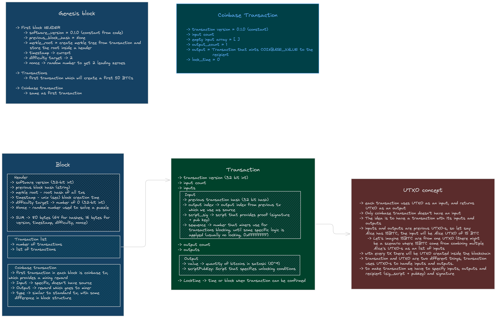

# Bitcoin in Rust 

## IN PROGRESS...

## Consensus simulation (PoW)
Instead of having each node mine and try to guess the hash, I created a simulation in which the main thread selects a random node that then mines a block and broadcasts it to the other nodes. The goal is to demonstrate how nodes propose blocks and communicate.

This is an ideal case where there are no malicious nodes and no nodes attempting to send an invalid block. Nodes can always expect a valid block.

TODO: Introduce a simulation with malicious nodes sending invalid blocks.

The system uses the `NUMBER_OF_NODES` constant, which creates `NUMBER_OF_NODES` nodes, where each node can be selected by the main thread to create a new block. Each node has a copy of the blockchain and runs an active thread that listens to the main thread, checking if it has been chosen to propose a new block. Additionally, it verifies whether another node has mined a new block and sent it to the other nodes. Furthermore, each node owns an account on the blockchain and has a secret and public key within its structure.